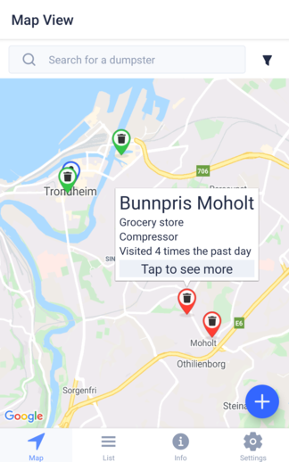
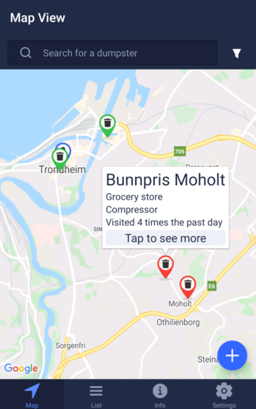

# Dumpster Finder

An app for dumpster divers

## External links

+ [API server test coverage](http://heleneyj.pages.stud.idi.ntnu.no/dumpster-diving/api-cov/)
+ [API server documentation](http://heleneyj.pages.stud.idi.ntnu.no/dumpster-diving/api-doc/)
+ [Photo server documentation](http://heleneyj.pages.stud.idi.ntnu.no/dumpster-diving/pic-doc/)
+ [Frontend documentation](http://heleneyj.pages.stud.idi.ntnu.no/dumpster-diving/app-doc/)
+ [Builds of the app](https://expo.io/accounts/toberge/projects/dumpster-finder/builds)
+ [Expo project page](https://expo.io/@toberge/projects/dumpster-finder)

## Instructions

+ [Backend](backend/README.md)
+ [API server](backend/api/README.md)
+ [Photo server](backend/pics/README.md)
+ [Database](backend/db/README.md)
+ [Frontend](frontend/README.md)
